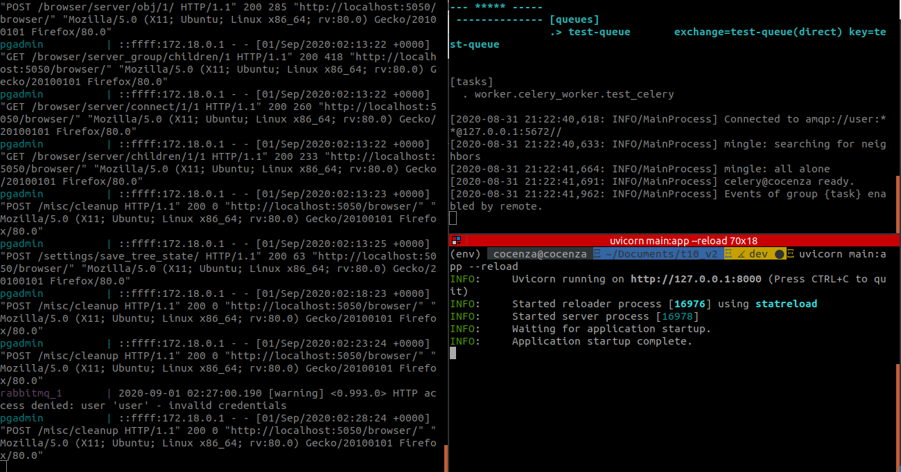
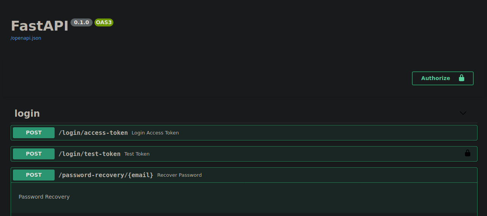
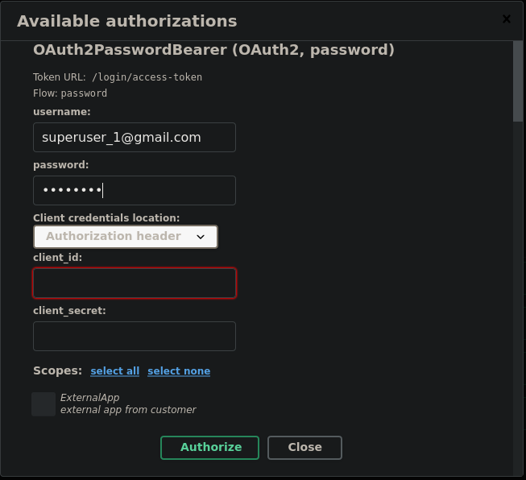
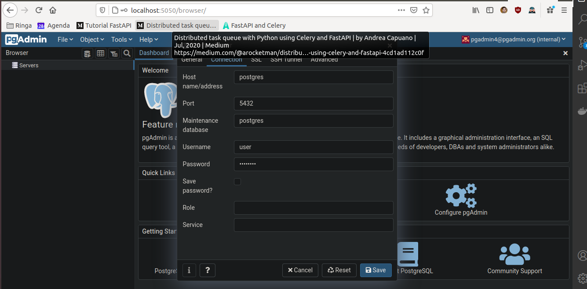
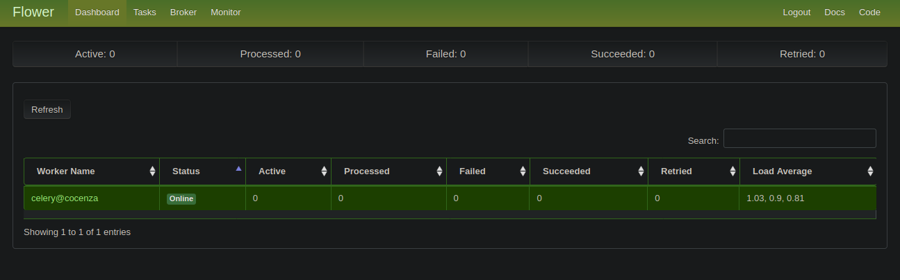
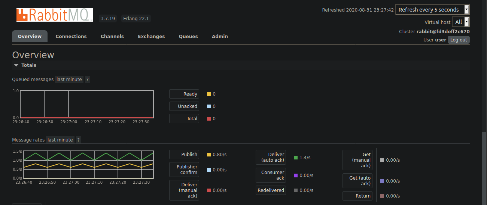

## Backend Requirements

* [Docker](https://www.docker.com/).
* [Docker Compose](https://docs.docker.com/compose/install/).
* python3.7 >

## Backend local development

* Start a virtual environment:
```bash
virtualenv env -p python3.7
source env/bin/activate
pip install -r requirements.txt
```
* Always use the virtualenv for the next steps:

* Start the application in another terminal with Docker Compose:

```bash
docker-compose up --build
```

* Populate the db with a superuser
```bash
sudo chmod +x prestart.sh
./ prestart.sh
```

* Start celery in another terminal:
```bash
celery worker -A worker.celery_worker -l info -Q test-queue -c 1
```

* Run the application:
```bash
uvicorn main:app --reload
```
By this point you should have three running terminals running the app, celery and docker more or less like this:


## Using the application:
* All the documentation of the api can be accessed from `localhost:8000/docs`. From there you can navigate in the FastAPI Swagger UI

* First of all you need to Authorize. Click into the Authorize button and access with user: `username: superuser_1@gmail.com` and `password: password` after this you should have a token that gives you acess to test-token, recover password, reset password and etc.
*During the generation of the token you can choose to have authorization as an ExternalAPP

* Normal users (Customer) doesn't have access of all routes.
* If you want to send emails you should configure these variables in the file `utils.py`
```python
EMAILS_FROM_NAME = 'foo@gmail.com'
EMAILS_FROM_EMAIL = 'foo@gmail.com'
SMTP_HOST = 'smtp.gmail.com'
SMTP_PORT = '465'
SMTP_TLS = True
SMTP_USER = 'foo@gmail.com'
SMTP_PASSWORD = 'password'
PROJECT_NAME = 'api'
EMAIL_TEMPLATES_DIR = "./email-templates/build"
SERVER_HOST = ''
EMAIL_RESET_TOKEN_EXPIRE_HOURS = 1
```

## Accessing the DB:
* Go to `localhost:5050` and login with user:pgadmin4@pgadmin.org password:password
* Click with the right button in Servers and create a new server
* Go to Connection and use Host:postgres Username:user Password:password


## Accessing Flower monitoring tool:
* Go to `localhost:5555` and login with User Name:user password:test


## Accessing RabitMQ:
* Go to http://localhost:15672 and login with username:user password:bitnami



## Observations
1. The URI of the DB, passwords, and the SECRET_KEY should never been exposed in the code during production. In this case, this application is just a template.

### Supporting Technology
- FastApi (Python)
- PostgreSQL
- RabitMQ
- Alembic
- Redis
- Celery